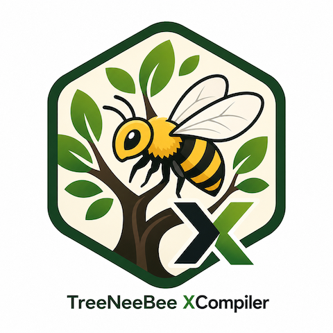
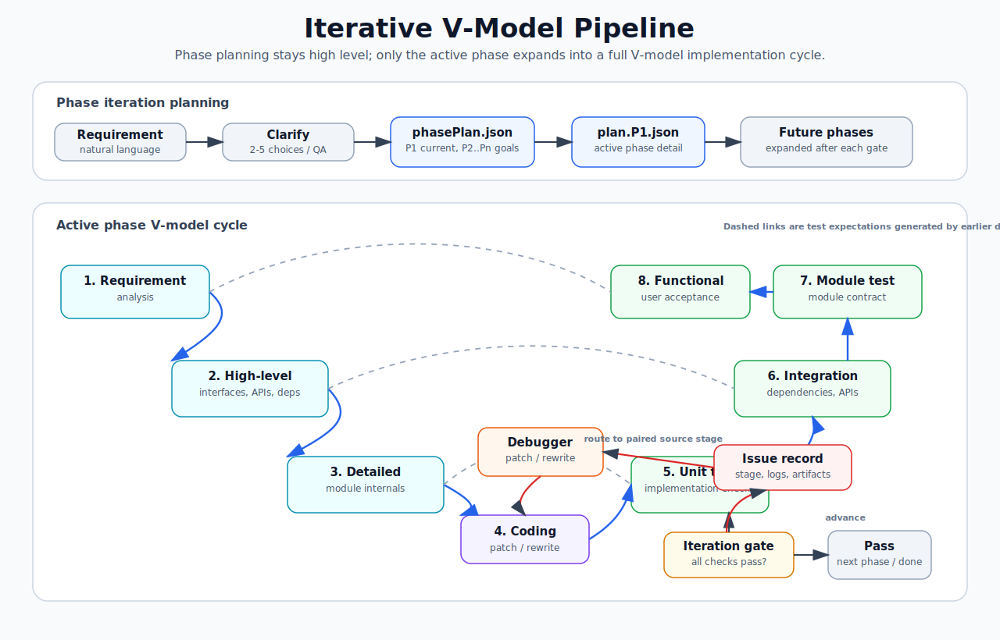
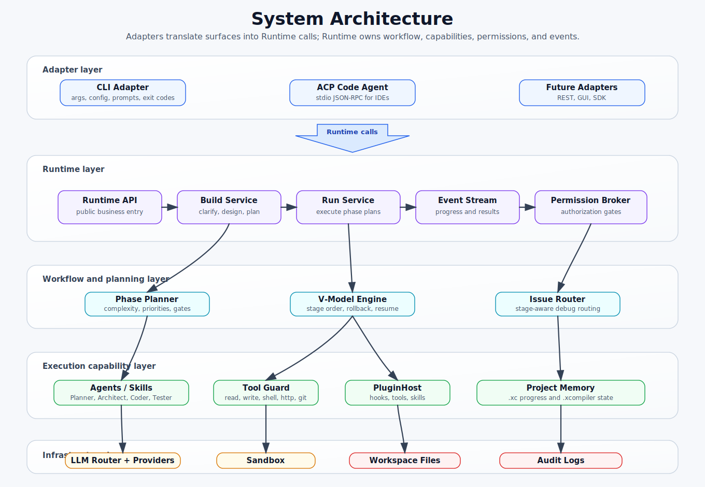

<p align="center">
  
</p>

<h1 align="center">XCompiler</h1>

<p align="center">
  <strong>AI 软件工厂运行时</strong>
</p>

> 通过迭代式 V 模型流程，把自然语言需求转成可运行、可测试、可交付的 Python 或 TypeScript 工程。

<p align="center">
  <a href="https://www.npmjs.com/package/@xcompiler/cli"></a>
  <a href="LICENSE"></a>
  <a href="https://nodejs.org">= 24" /></a>
</p>

语言: [EN](README.md) (默认) · **简体中文**

---

## XCompiler 做什么

XCompiler 是一个可复用的 AI 软件工厂运行时。它先把产品需求编译成可执行工程计划，再用受沙盒约束的多 Agent、受控工具、测试门禁、Debug 回退、审计日志和可恢复工程状态来执行计划。

| 命令 | 定位 | 输入 | 输出 |
|---|---|---|---|
| `xcompiler build` | 把需求编译成 `phasePlan.json` 和当前阶段计划，例如 `plan.P1.json` | 需求文本（`-i req.md`、`-t topic.md` 或交互输入） | `topic.md`、`phasePlan.json`、`plan.P1.json`、`plan.md`、`<name>.xc` |
| `xcompiler run` | 按 V 模型执行当前阶段 | `phasePlan.json` 或历史 `plan.json` | 可运行工程、测试、文档、审计、更新后的进度 |
| `xcompiler load` | 从工程文件恢复 | `<name>.xc` | 继续保存的阶段/任务状态 |
| `xcompiler append` / `xcompiler evolve` | 在已有工程上追加需求 | 现有 workspace/工程文件 + 新需求 | 增量计划和实现 |
| `xcompiler acp` | 作为 ACP Code Agent Adapter 运行 | IDE/Editor 通过 stdio JSON-RPC 调用 | 基于 Runtime 的代码代理事件和结果 |

当前架构中，**Runtime 是唯一业务入口**。CLI 和 ACP 都只是 Adapter：负责解析输入、加载配置、渲染输出、监听 Runtime 事件；Build/Run/Workflow/Agent/Tool/Plugin/Memory 等业务能力统一由 Runtime 提供。

---

## 迭代式 V 模型流程

XCompiler 把 Phase 迭代模型和 V 模型结合起来。Planner 先生成总览级 `phasePlan.json`，再只展开当前阶段为具体 `plan.P<N>.json`。每个当前阶段都执行完整 V 模型；未来阶段只保留目标，等激活后再展开细节计划。

<p align="center">
  
</p>

V 模型行为：

- `REQUIREMENT_ANALYSIS`、`HIGH_LEVEL_DESIGN`、`DETAILED_DESIGN`、`CODE` 会同步生成对应下游测试期望。
- `HIGH_LEVEL_DESIGN` 定义系统级接口、外部 API、第三方库选型和依赖确认。
- `DETAILED_DESIGN` 定义模块内部结构和具体实现方案。
- 测试失败先记录为 issue，再路由回匹配的上游阶段交给 Debugger 修复。
- 已完成阶段的 Debug 必须提供真实 patch/rewrite 或成功验证证据。
- 网络/API 调用失败是正式门禁：项目 API 失败时必须修复或切换可用 API，不能跳过或掩盖。

---

## 系统架构

<p align="center">
  
</p>

各层职责：

- **Adapters**：参数/协议解析、配置加载、用户交互、输出渲染、Exit Code。
- **Runtime**：Build、Run、Workflow、Agent、Tool、Plugin、Memory、Permission 的唯一业务 API。
- **Workflow engine**：Phase 迭代、V 模型调度、回退/Debug 路由、迭代门禁、断点恢复。
- **Agents / Skills**：每个阶段的角色化 prompt 与工具白名单。
- **Tools**：文件编辑、程序/测试执行、API fetch、依赖修改、git 快照，全部受门禁约束。
- **LLM Router**：角色链、动态评分、cluster fallback、OpenAI-compatible/Ollama 客户端、审计。
- **Workspace**：`phasePlan.json`、`plan.P<N>.json`、`<name>.xc`、`.xcompiler/audit.jsonl`、Debug cache、Project memory。

---

## 从 npm 安装

```bash
npm install -g @xcompiler/cli
mkdir xcompiler-demo && cd xcompiler-demo
cp "$(npm root -g)/@xcompiler/cli/config.example.yaml" config.yaml
cp "$(npm root -g)/@xcompiler/cli/.env.example" .env
# 编辑 .env，填入 OPENROUTER_API_KEY
xcompiler doctor
```

默认模板使用 OpenRouter Free mode，并通过 `type: openai` 的 OpenAI-compatible provider 访问：

```yaml
model: openrouter/free
base_url: https://openrouter.ai/api/v1
```

`config.yaml` 和 `llm_scores.yaml` 都是用户本地运行态文件，故意不提交到仓库。npm 包只发布 `config.example.yaml` 和 `.env.example` 作为模板。

---

## 快速开始

```bash
echo "把 DBC 文件解析为 Excel 报表" > req.md
xcompiler build -i req.md --yes
xcompiler run /tmp/xcompiler-<时间戳>/phasePlan.json
xcompiler load /tmp/xcompiler-<时间戳>/xcompiler-<时间戳>.xc
```

源码仓库开发：

```bash
npm ci
cp .env.example .env
cp config.example.yaml config.yaml
npm run build
npm link
xcompiler --help
```

不 link 的开发模式：

```bash
npm run dev -- build -i req.md --yes
npm run dev -- run path/to/phasePlan.json
```

增量开发：

```bash
xcompiler build -w path/to/workspace -i feature_req.md --intent feature --yes
xcompiler evolve -w path/to/workspace -i refactor_req.md --intent refactor --yes
xcompiler append path/to/workspace/<name>.xc -i feature_req.md --yes
```

自举开发：

```bash
xcompiler bootstrap -r path/to/XCompiler -i self_req.md --yes
```

---

## 常用命令

| 命令 | 用途 |
|---|---|
| `xcompiler build -i <file>` | 从需求文件生成阶段计划 |
| `xcompiler build -t <topic.md>` | 复用已澄清 topic，跳过 Gate 1 |
| `xcompiler run <phasePlan.json>` | 执行当前阶段计划 |
| `xcompiler run --from <stepId>` | 从指定 Step 断点恢复 |
| `xcompiler run --phase <phase>` | 只执行某个阶段/状态 |
| `xcompiler load <name.xc>` | 读取工程配置/进度并继续 |
| `xcompiler append <name.xc> -i <file>` | 在已有工程上追加新需求 |
| `xcompiler evolve -w <workspace> -i <file>` | 编译并执行一次增量变更 |
| `xcompiler acp` | 启动 ACP Code Agent stdio adapter |
| `xcompiler doctor` | 检查配置、LLM provider、sandbox、skills 是否可用 |
| `xcompiler ls` / `xcompiler show <stepId>` | 查看计划和最近审计 |
| `npm run release:local -- vX.Y.Z` | 本地准备 release commit 和 tag，不 push |

---

## 默认运行时

- **LLM**：默认 OpenRouter Free mode。key 缺失或无效时会输出 provider、model、base URL、HTTP 状态/响应体，并明确提示 `OPENROUTER_API_KEY`。
- **LLM 路由**：角色专用 provider 链、动态评分、`score=0` 手动禁用、`tags: [cluster]` 聚合路由兜底评分带。
- **语言**：支持 Python 与 TypeScript 的工程生成、测试、运行和入口检查。
- **Sandbox**：默认 `subprocess`；可切换 `docker` 以启用 bind-mount 隔离和网络/资源限制。
- **Audit**：每次运行写入 `.xcompiler/audit.jsonl`、LLM stream trace、`docs/process_log.md`、Debug cache 和 Project memory。
- **安全门禁**：项目文件访问受控，写工具限制在 Step 声明 outputs 内，敏感操作可通过 Adapter 暴露为权限事件。

---

## 运行期调优

LLM 路由配置位于 `config.yaml -> llm.*`。

| 字段 | 默认 | 作用 |
|---|---|---|
| `roles.<Role>` | 按角色不同 | Planner、Architect、Coder、Tester、Debugger 的 provider 候选链 |
| `scores.<provider>` | `1.0` | 初始评分；`0` 表示用户手动禁用 |
| `cluster_score_min/max` | `0.2..0.5` | `cluster` provider 的动态评分范围 |
| `max_rounds_per_step` | `6` | 普通 Step 的 LLM 对话轮数上限 |
| `max_debug_rounds_per_step` | `max(8, 2 * max_rounds_per_step)` | Debugger 对话轮数上限 |
| `max_debug_retries` | `3` | Debug 重试次数 |
| `max_edit_lines_per_step` | `auto` | EditGuard 单 Step 累计写入行数预算 |
| `max_write_chunk_bytes` | `auto` | 单次写入 chunk 字节预算 |
| `sandbox_limits.network` | `download-only` | 默认允许出站下载且不发布入站端口；`off` 为断网 |

---

## 文档

| 路径 | 内容 |
|---|---|
| [docs/openrouter.md](docs/openrouter.md) | OpenRouter Free mode 与 OpenAI-compatible provider 配置 |
| [docs/acp.md](docs/acp.md) | ACP Code Agent Adapter 协议说明 |
| [docs/XCompiler_design.md](docs/XCompiler_design.md) | 核心设计与 V 模型概念 |
| [docs/plugin_api.md](docs/plugin_api.md) | Plugin API、生命周期 hooks、tools、skills |
| [docs/versioning.md](docs/versioning.md) | 版本源、release 脚本、tag 策略 |
| [docs/self_bootstrap.md](docs/self_bootstrap.md) | 自举开发与 qualification gates |
| [docs/deploy.md](docs/deploy.md) | 本地、Docker、native package 部署 |
| [docs/dev_audit_log.md](docs/dev_audit_log.md) | 历史开发交付日志 |

---

## 测试

```bash
npm run version:check
npm run typecheck
npm run lint
npm test
npm run build
```

最近本地 release gate：49 个测试文件 / 473 个测试通过。

---

## License

[Apache License 2.0](LICENSE) © 2026 The XCompiler Authors. 详见 [NOTICE](NOTICE)。
