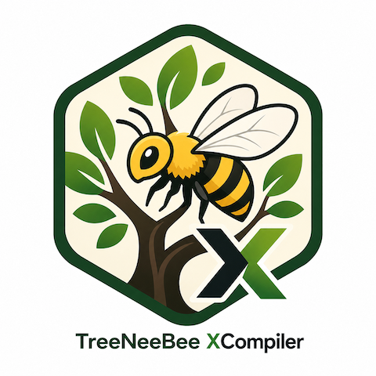
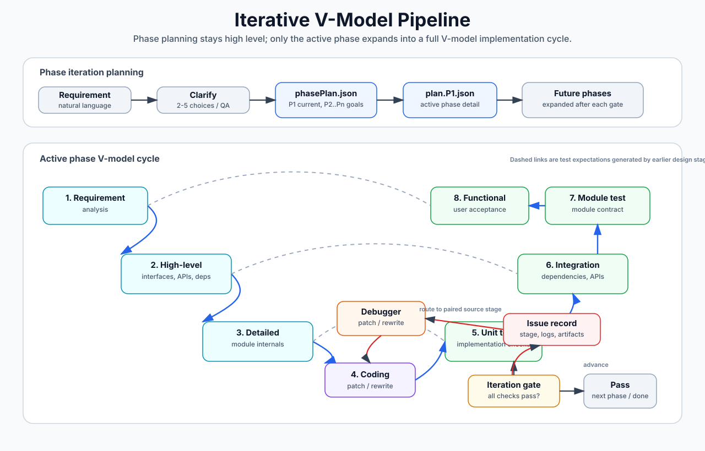
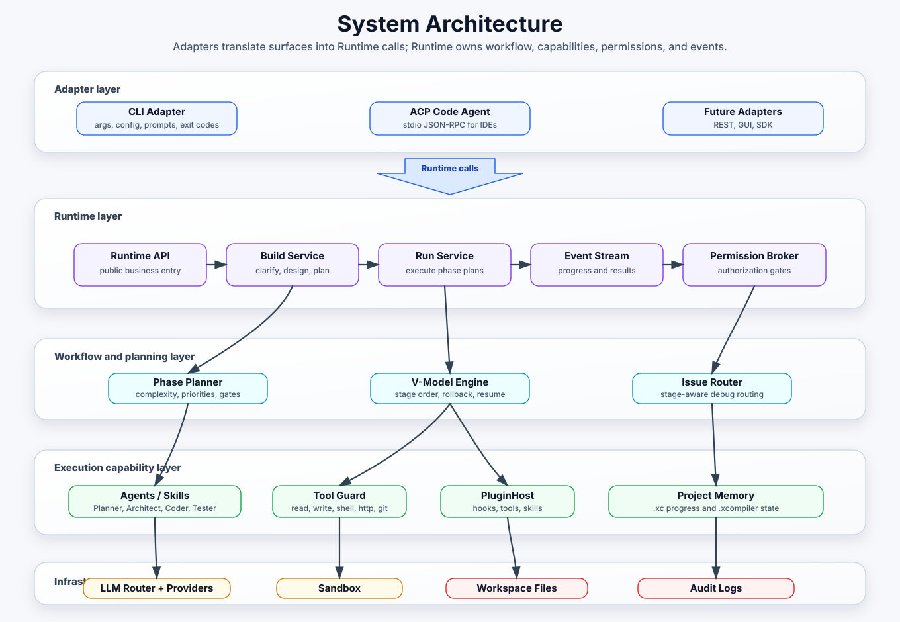

<p align="center">
  
</p>

<h1 align="center">XCompiler</h1>

<p align="center">
  <strong>AI 软件工厂运行时</strong>
</p>

> 通过迭代式 V 模型流程，把自然语言需求转成可运行、可测试、可交付的 Python 或 TypeScript 工程。

<p align="center">
  <a href="https://www.npmjs.com/package/@xcompiler/cli"></a>
  <a href="LICENSE"></a>
  <a href="https://nodejs.org">= 24" /></a>
</p>

语言: [EN](README.md) (默认) · **简体中文**

---

## XCompiler 做什么

XCompiler 是一个可复用的 AI 软件工厂运行时。它先把产品需求编译成可执行工程计划，再用受沙盒约束的多 Agent、受控工具、测试门禁、Debug 回退、审计日志和可恢复工程状态来执行计划。

| 命令 | 定位 | 输入 | 输出 |
|---|---|---|---|
| `xcompiler build` | 把需求编译成 `phasePlan.json` 和当前阶段计划，例如 `plan.P1.json` | 需求文本（`-i req.md`、`-t topic.md` 或交互输入） | `topic.md`、`phasePlan.json`、`plan.P1.json`、`plan.md`、`<name>.xc` |
| `xcompiler run` | 按 V 模型执行当前阶段 | `phasePlan.json` | 可运行工程、测试、文档、审计、更新后的进度 |
| `xcompiler load` | 从工程文件恢复 | `<name>.xc` | 继续保存的阶段/任务状态 |
| `xcompiler append` / `xcompiler evolve` | 在已有工程上追加需求 | 现有 workspace/工程文件 + 新需求 | 增量计划和实现 |
| `xcompiler acp` | 作为 ACP Code Agent Adapter 运行 | IDE/Editor 通过 stdio JSON-RPC 调用 | 基于 Runtime 的代码代理事件和结果 |

当前架构中，**Runtime 是唯一业务入口**。CLI 和 ACP 都只是 Adapter：负责解析输入、加载配置、渲染输出、监听 Runtime 事件；Build/Run/Workflow/Agent/Tool/Plugin/Memory 等业务能力统一由 Runtime 提供。

---

## 迭代式 V 模型流程

XCompiler 把 Phase 迭代模型和 V 模型结合起来。Planner 先生成总览级 `phasePlan.json`，再只展开当前阶段为具体 `plan.P<N>.json`。每个当前阶段都执行完整 V 模型；迭代门禁和工程审计通过后标记为 `complete`，再激活首个依赖已满足的阶段，并且只为下一次运行生成该阶段计划。

<p align="center">
  
</p>

V 模型行为：

- 每个 Phase 固定包含八个领域 Step：需求分析、概要设计、详细设计、编码、单元测试、集成测试、系统测试、验收测试。
- Planner JSON 是不可变的执行规格，不再保存运行状态。Runtime 将其编译为领域对象，只有这些对象持有生命周期状态。每个对象都带同一套 envelope —— UUIDv7 `id`、`objectType`、`projectId`、`revision` 和时间戳 —— 并统一经对象注册表提交：Project、ProjectPlan/PhasePlan、Phase、Step、Ticket、ActorRegistration、TicketAssignment、TicketTraceEvent、ProjectManagementPlan、Decision、Risk、InteractionRequest、KPI、QualityAssessment、Changelist、Checkpoint、Deliverable、Report、Log、AuditEvent 和 DomainEvent。
- 需求分析、概要设计、详细设计、编码会同步生成对应的验收、系统、集成、单元测试计划和可执行用例。
- `HIGH_LEVEL_DESIGN` 定义系统级接口、外部 API、第三方库选型和依赖确认。
- `DETAILED_DESIGN` 定义模块内部结构和具体实现方案。
- Ticket 类型固定为 `epic`、`story`、`task`、`bug`、`enhancement`、`change-request`。展示名如 `P1-S004` 只用于阅读，所有关系都使用全局 ID。
- 测试或执行失败创建 Bug，并路由到配对的上游 Step；完成度、对齐度或覆盖指标不足创建 Enhancement。
- 失败归属发现它的 Step，目标由 V 模型配对关系决定，不继承当时恰好活跃的 CR 链起点。
- 验证 Step 的门禁同时跑配对基线和该 Step 自己撰写的补充测试。缺陷只落在补充里就留在写它的 Step——交给配对源等于给它一个无权写入的文件；只要有一个失败用例属于基线，整条 finding 仍回到配对源。
- 两条 CR 传导同一跳（相同源 Step、相同目标 Step、相同起因失败）时并入已承载该跳的那条，不各自开链。
- 同一失败反复出现时 Ticket 会停止，而不是耗尽预算。是否「同一个失败」由结构化签名判定：签名只含失败本身（失败用例、失败类型、原因的稳定部分），不含工具命令行、运行器分配的临时目录、地址或计数器——这些在两次完全相同的失败之间也会变。
- 上游修复先形成 CR，携带契约差异、影响 Step/产物、实施方案、changelist、commit 和验证门禁；下游只实施增量变化。
- CR 下游失败会创建关联 Bug 并阻塞父 CR；配对源 Step 修复和子 CR 验证通过后，只恢复父 CR 尚未完成的应用步骤。
- Bug 只有在开票的那个失败于观察到它的 Step 重跑并通过后才关闭。每张 Bug 携带验证契约（该 Step 与要重放的选择器），满足时追加不可变的验证记录。未满足则**拒绝关闭而非抛错**：未完成的纠正链让 Bug 保持打开、Story 保持阻塞，下一条到达该门禁的链仍能把它做完。
- Bug 只有在所有受影响 CR 门禁通过、方案被验证并写入 Debug Wiki 后才关闭。失败的历史方案会标记为待复核。
- 每一次失败报告都保留为独立 Ticket。PM 在分派前比对已注册的 Bug，把结构性重复（目标 Step 相同、失败身份相同）挂到提交最早的那张上并记录路由决策。被挂起的重复票不参与调度，并随原始票进入其终态。
- CR 携带开链时确定的传导范围，因此仅修改配对基线测试的修复可直达其验证 Step，不必逐跳走完中间各阶段。
- 已完成阶段的 Debug 必须提供真实 patch/rewrite 或成功验证证据。
- 网络/API 调用失败是正式门禁：项目 API 失败时必须修复或切换可用 API，不能跳过或掩盖。

---

## 系统架构

<p align="center">
  
</p>

各层职责：

- **Adapters**：参数/协议解析、配置加载、用户交互、输出渲染、Exit Code。
- **Runtime**：Runtime API、Build Service、Run Service、Event Stream、Permission Broker，是唯一业务入口。
- **Workflow and planning**：Planner 草案、领域图编译、Phase 迭代、V 模型依赖调度、失败路由、质量门禁、交付和精确恢复。
- **State policy**：领域对象是唯一运行真相；Planner 文件不含执行状态，Adapter 和 Agent 不得直接修改持久化生命周期。
- **Agents / Skills**：按 Agent Skills Specification 组织目录；Planner 只加载元数据，执行时再激活正文和按需资源，最终 Tool 仍受 Runtime 门禁约束。
- **Tools**：文件编辑、程序/测试执行、API fetch、依赖修改、git 快照，全部受门禁约束。
- **LLM Router**：角色链、动态评分、cluster fallback、OpenAI-compatible/Ollama 客户端、审计。
- **项目容器**：工程根 `control` 空间保存 `<name>.xc`、`phasePlan.json` 和 `plan.P<N>.json`；`.xcompiler/` 保存 PM 状态、不可变对象 revision、Record/Replay、Debug Wiki 和完整审计；`worktrees/master/` 是唯一权威产品树和发布来源，Ticket/Gate worktree 只是临时候选分支。

注册表追加事件是恢复依据，快照索引可重建。每个条目记录对象 ID、类型、路径、父对象、revision、内容哈希和生命周期状态。

---

## 从 npm 安装

```bash
npm install -g @xcompiler/cli
mkdir xcompiler-demo && cd xcompiler-demo
cp "$(npm root -g)/@xcompiler/cli/config.example.yaml" config.yaml
cp "$(npm root -g)/@xcompiler/cli/.env.example" .env
# 编辑 .env，填入 OPENROUTER_API_KEY
xcompiler doctor
```

默认模板使用 OpenRouter Free mode，并通过 `type: openai` 的 OpenAI-compatible provider 访问：

```yaml
model: openrouter/free
base_url: https://openrouter.ai/api/v1
```

`config.yaml`、`llm_scores.yaml` 和 `llm_scores_user.yaml` 都是本地文件，故意不提交到仓库。npm 包只发布 `config.example.yaml` 和 `.env.example` 作为模板。`llm_scores.yaml` 是 XCompiler 自动维护的运行态分数；只有需要固定本地覆盖策略时，才创建 `llm_scores_user.yaml`，例如用 `provider: 0` 禁用某个 provider。

---

## 快速开始

```bash
echo "把 DBC 文件解析为 Excel 报表" > req.md
xcompiler build -i req.md --yes
xcompiler run /tmp/xcompiler-<时间戳>/phasePlan.json
xcompiler load /tmp/xcompiler-<时间戳>/xcompiler-<时间戳>.xc
```

源码仓库开发：

```bash
npm ci
cp .env.example .env
cp config.example.yaml config.yaml
npm run build
npm link
xcompiler --help
```

不 link 的开发模式：

```bash
npm run dev -- build -i req.md --yes
npm run dev -- run path/to/phasePlan.json
```

增量开发：

```bash
xcompiler build -w path/to/workspace -i feature_req.md --intent feature --yes
xcompiler evolve -w path/to/workspace -i refactor_req.md --intent refactor --yes
xcompiler append path/to/workspace/<name>.xc -i feature_req.md --yes
```

自举开发：

```bash
xcompiler bootstrap -r path/to/XCompiler -i self_req.md --yes
```

---

## 常用命令

| 命令 | 用途 |
|---|---|
| `xcompiler build -i <file>` | 从需求文件生成阶段计划 |
| `xcompiler build -t <topic.md>` | 复用已澄清 topic，跳过 Gate 1 |
| `xcompiler run <phasePlan.json>` | 执行当前阶段计划 |
| `xcompiler run --debug-wiki-path <dir>` | 复用并更新共享分层 Debug wiki 路径 |
| `xcompiler load <name.xc>` | 读取工程配置/进度并继续 |
| `xcompiler append <name.xc> -i <file>` | 在已有工程上追加新需求 |
| `xcompiler evolve -w <workspace> -i <file>` | 编译并执行一次增量变更 |
| `xcompiler acp` | 启动 ACP Code Agent stdio adapter |
| `xcompiler doctor` | 检查配置、LLM provider、sandbox、skills 是否可用 |
| `xcompiler ls` / `xcompiler show <stepId>` | 查看计划和最近审计 |
| `npm run release:local -- vX.Y.Z` | 本地准备 release commit 和 tag，不 push |

---

## 默认运行时

- **LLM**：默认 OpenRouter Free mode。key 缺失或无效时会输出 provider、model、base URL、HTTP 状态/响应体，并明确提示 `OPENROUTER_API_KEY`。
- **LLM 路由**：角色专用 provider 链、XCompiler 自动维护的动态评分、`llm_scores_user.yaml` 用户覆盖，以及 `tags: [cluster]` 聚合路由兜底评分带。
- **语言**：支持 Python 与 TypeScript 的工程生成、测试、运行和入口检查。
- **Sandbox**：默认 `subprocess` 且隔离宿主环境变量（`inherit_env: false`）；可切换 `docker` 获得可执行的网络/资源隔离。subprocess 无法兑现 `network: off`，因此该组合会明确报错。
- **Audit**：每次运行写入人类可读日志，并持久化带 correlation/causation ID 的领域 AuditEvent 和 Log 对象。
- **Debug wiki**：Debugger 处理 Bug Ticket 时会基于压缩后的 `DebugBrief` 检索 LLM-wiki 风格的历史修复经验。wiki 是分层 Markdown 知识库：随包发布的 `wiki/system` 策略页、随包发布的 `wiki/agent` calibration 页、本地 `wiki/external` 真实 Bug 解决方案页。Runtime 会重新生成 `index.md` 供人工审阅、`index.json` 供检索使用；`log.md` 则保留为本地追加式操作流水，不由索引或摘要重建。默认复制到 XCompiler 路径（设置 `XC_PATH` 时为 `$XC_PATH/.xcompiler/debug-wiki`，否则为包/仓库根目录），也可用 `--debug-wiki-path <dir>` 指定共享根目录。Bug 的全部 CR 验证通过后才把 `bugResolutionPlan` 写入 `external`；复用方案失败会通过 feedback overlay 标为 `needs_review`，后续成功修复会创建或纠正 external 条目。
- **Record/Replay**：针对 HTTP、LLM 和 Tool 的外部数据提供记录与重放；当前工程的代码、构建和测试始终真实执行，Replay 只提供外部 fixture，不复用旧进程退出码。Phase 交付门禁中的真实用户场景会关闭 Replay。
- **Agent Skills**：内置文件、Web、测试、Debug、Record/Replay、Debug Wiki、依赖、评审、安全、性能、CR 和交付工作流。Planner 只读取 `name + description`，Run 只激活所选 Skill 的正文与按需资源；Plugin API 3 可引入标准 Skill 目录，但不能绕过 Runtime 权限、路径、Ticket 或门禁。
- **安全门禁**：项目文件访问受控，写工具限制在 Step 声明 outputs 内，每个敏感操作都必须经过 Adapter 的明确权限策略；缺少授权处理器时默认拒绝。

---

## 运行期调优

LLM 路由配置位于 `config.yaml -> llm.*`。

| 字段 | 默认 | 作用 |
|---|---|---|
| `roles.<Role>` | 按角色不同 | `Planner`、`Architect`、`Coder`、`Tester`、`Debugger`、`ProjectManager` 的 provider 候选链。所有角色都在此配置；`ProjectManager` 代表项目判定交付结果，不执行 Step |
| `providers.<name>.context_window` | `128K` | Provider 的上下文容量；为空时使用默认值，模型切换后会重新计算工具窗口 |
| `llm_scores_user.yaml` | 不存在 | 本地用户评分覆盖；`0` 禁用 provider，`0.1..1` 固定有效优先级 |
| `cluster_score_min/max` | `0.2..0.5` | `cluster` provider 的动态评分范围；用户覆盖仍可使用 `0.1..1` |
| `agent.sandboxes.python.mode` | `subprocess` | Python 工程沙盒后端：本地 subprocess 或 Docker |
| `agent.sandboxes.typescript.mode` | `subprocess` | TypeScript 工程沙盒后端：本地 subprocess 或 Docker |
| `agent.sandboxes.<language>.local.inherit_env` | `false` | 是否显式继承宿主环境；宿主含 API key 等机密时应保持关闭 |
| `max_rounds_per_step` | `6` | 普通 Step 的 LLM 对话轮数上限 |
| `max_debug_rounds_per_step` | `max(8, 2 * max_rounds_per_step)` | Debugger 对话轮数上限 |
| Planner `Step.maxAttempts` | 按复杂度自适应 | Step 事务尝试上限；随 simple/moderate/complex 和 Phase 数量增长 |
| `--debug-wiki-path <dir>` | XCompiler 路径下的 `.xcompiler/debug-wiki` | 共享分层 Debug wiki 根目录路径 |
| `max_edit_lines_per_step` | `auto` | EditGuard 单 Step 累计写入行数预算 |
| `permissions.mode` / `--permission-mode` | `request` | 当前 Runtime task 的外部资源授权策略：`request`、`auto` 或 `deny`；工程内部操作不弹权限确认 |
| `permissions.timeout_ms` | `0` | 权限等待超时；`0` 表示等待用户回答或取消 task |
| `agent.sandboxes.<language>.<local\|docker>.limits.network` | `download-only` | Docker 可执行 `off`；subprocess 会拒绝 `off`，避免声称无法兑现的隔离 |
| `providers.<name>.tcp_keepalive_ms` | `30000` | 连接静默多久后内核开始发探活包。断网留下的 socket 收不到 RST/FIN，探活是唯一能把它变成真正连接错误的机制；`0` 关闭 |
| `providers.<name>.stream_headers_timeout_ms` | `30000` | 仅对流式生效的响应头期限。流式服务端先写响应头再开始思考，所以「头没来」是连接问题、「头来了但 token 慢」是模型问题；`0` 不限制 |
| `stall_diagnosis_after_ms` | `600000` | 对端持续这么久未送来任何字节时跑一次环境诊断，并把结论随失败一起交出 |

审计不会为了控制体积裁剪原始数据：`.xcompiler/audit/audit.jsonl` 和 `process_log.md` 完整追加保存；`summary.md` 是独立的可重建摘要，保留原始行号和不可变对象 revision 链接，供按需访问详细记录。

---

## 文档

| 路径 | 内容 |
|---|---|
| [docs/openrouter.md](docs/openrouter.md) | OpenRouter Free mode 与 OpenAI-compatible provider 配置 |
| [docs/acp.md](docs/acp.md) | ACP Code Agent Adapter 协议说明 |
| [docs/agent_skills.md](docs/agent_skills.md) | Agent Skills 标准、内置目录、安全边界与 Plugin API 3 |
| [docs/XCompiler_design.md](docs/XCompiler_design.md) | 核心设计与 V 模型概念 |
| [docs/XCompiler_project_constraints.md](docs/XCompiler_project_constraints.md) | 架构、归属、生命周期与目录布局等必须保持的工程约束 |
| [docs/XCompiler_project_constraints.md](docs/XCompiler_project_constraints.md) | 当前架构、PM/Ticket 生命周期、工作区与发布约束 |
| [docs/plugin_api.md](docs/plugin_api.md) | Plugin API、生命周期 hooks、tools、skills |
| [docs/versioning.md](docs/versioning.md) | 版本源、release 脚本、tag 策略 |
| [docs/self_bootstrap.md](docs/self_bootstrap.md) | 自举开发与 qualification gates |
| [docs/deploy.md](docs/deploy.md) | 本地、Docker、native package 部署 |
| [docs/features/0.5.0/user_fixture.md](docs/features/0.5.0/user_fixture.md) | 0.5.0 规划：导入真实用户样例（`--fixture`），接口和生命周期待确认 |
| [docs/archive/](docs/archive/) | 已交付的设计与重构计划，保留代码本身不再解释的决策依据；不是当前文档 |

---

## 测试

```bash
npm run version:check
npm run typecheck
npm run lint
npm test
npm run build
```

测试套件按所需能力分档，受限环境（例如禁止监听 127.0.0.1）仍可完整跑确定性门禁，
而不会把环境限制误报成产品缺陷：

```bash
npm run test:core          # 仅确定性用例；不开端口、不拉子进程
npm run test:integration   # 需要本机回环 HTTP 服务与真实子进程
npm run test:e2e           # 拉起真实 CLI/ACP 进程
```

Release gate 始终执行当前完整测试集，不使用固定的历史测试数量作为验收声明。

---

## License

[Apache License 2.0](LICENSE) © 2026 The XCompiler Authors. 详见 [NOTICE](NOTICE)。
