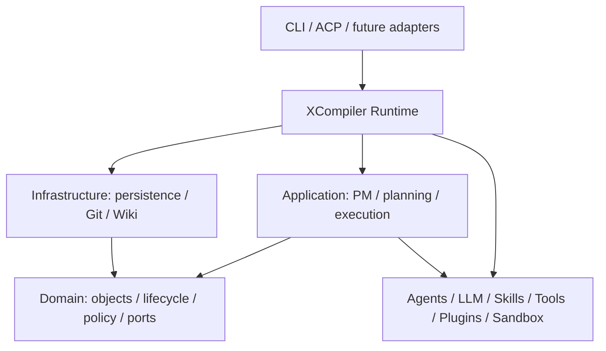

# XCompiler 领域与运行时设计

> XCompiler 是以 Runtime 为唯一业务入口、以领域对象和 Ticket 驱动迭代式 V 模型的软件工厂。

## 1. 设计目标

- `build` 负责需求澄清、复杂度判断、Phase 总计划和当前 Phase 详细计划。
- `run` 负责无普通聊天交互的自动执行，只在敏感操作时请求授权。
- CLI、ACP 和未来的 REST/GUI/SDK 都只能调用 Runtime。
- Planner 输出是可审阅的执行规格，领域对象才是生命周期、恢复和审计真相。
- 每次迭代都是完整 V 模型；错误不能跳过门禁，必须形成 Ticket 并按配对关系回退。
- 所有持久化对象使用全局唯一 UUIDv7；`name` 仅作为可读标签。

## 2. 分层架构



图中的箭头表示主要依赖方向。Runtime 组装具体实现并注入 Application；Domain 不反向依赖
Infrastructure，也不读取文件或启动进程。Infrastructure 还可实现 Application 声明的能力端口，
例如 `DebugWikiPort`，Application 不导入其文件实现。

0.4 已在工作树中移除 `src/core/`：计划、门禁等纯契约归入 Domain；规划推进、报告和执行协调
归入 Application；计划、项目清单和 Wiki 的文件存储归入 Infrastructure。`PlanStorePort` 区分
文档结构读取与严格执行计划加载，避免增量规划摘要意外触发执行门禁。Runtime 注入
`FilePlanStore`、`FileDebugWiki` 和对象仓库；这些迁移仍待统一验证，进度见
[0.4 交接记录](features/0.4.0/HANDOVER.md)。

Adapter 只负责参数或协议、配置、交互、输出和退出码。它不得直接调用 Planner、Agent、Tool、Plugin、Memory、文件系统或命令执行实现。

模型角色只有一份清单：`Planner`、`Architect`、`Coder`、`Tester`、`Debugger`、`ProjectManager`。
每个角色在 `llm.roles` 下独立配置 provider 链，Router 如何在链内调度是它自己的事，其余部分不依赖。
`ProjectManager` 代表项目判定交付结果，它不执行 Step；把它做成独立角色而不是借用 Planner 的注册，
是为了让它以自己的身份配置和发声。


## 3. 统一对象模型

每个持久化对象都包含统一 envelope：

```ts
interface ObjectEnvelope {
  id: ObjectId;          // UUIDv7，全局唯一且不可变
  name: string;          // P1-S004 等展示名，不参与关联
  objectType: ObjectType;
  projectId: ObjectId;
  schemaVersion: number;
  revision: number;
  createdAt: string;
  updatedAt: string;
}
```

对象类型：

| 对象 | 责任 |
| --- | --- |
| Project | 项目主题、Phase 集合、当前 Phase、项目交付和报告 |
| ProjectPlan | 复杂度、PhasePlan 列表、当前 Phase 与规划来源摘要 |
| Phase | 一次迭代目标、依赖、Epic、八个 Step 和阶段门禁 |
| PhasePlan | 单个 Phase 的范围、Step 列表、验证门禁和物化状态 |
| Step | V 模型阶段、输入输出、依赖、配对、KPI、尝试次数和状态 |
| Ticket | 工作、缺陷、增强和变更传导的唯一工作载体 |
| KPI / QualityAssessment | 可量化门槛、观测值、容差、证据和判定 |
| Changelist | Ticket 在某个 Step 的增量修改、commit 和验证证据 |
| Checkpoint | 不可变的对象快照引用和事件序号 |
| Deliverable / Report | 交付路径、验收条件和阶段/项目报告 |
| Log / AuditEvent | Ticket 日志及带 correlation/causation 的领域审计 |
| ActorRegistration / Assignment | 角色能力注册、Ticket 所有权和容量 |
| ProjectManagementPlan | PM 范围基线、状态、风险、决策和交互索引 |
| Decision / Risk / InteractionRequest | PM 决策、风险控制和用户授权证据 |
| TicketTraceEvent | 只追加、哈希链保护的 Ticket 流转调用链 |
| DomainEvent | 与对象修改同一 UnitOfWork 提交的 outbox 事件 |

关系只保存 ID 或 `{ id, objectType }`。父 ID 是权威关系；子列表和反向依赖是可校验投影。

## 4. Planner 与领域边界

`phasePlan.json` 和 `plan.P<N>.json` 是 Planner 规格：

- `phasePlan.json` 先描述一个或多个 Phase 的目标、范围、依赖和交付门禁。
- 只为当前 Phase 生成 `plan.P<N>.json`，后续 Phase 到达时才物化。
- Planner Step 使用 `S001` 等局部标签，包含 prompt、工具、输入、输出和最多两层子任务。
- Planner 文件不包含运行状态、重试状态或恢复游标。

Build 通过 Planning Compiler 一次性创建当前领域图，并由 PM 立即注册全部 Ticket、记录活动 Phase 选择、导入澄清记录并刷新项目状态投影：

```text
Project
  ProjectPlan
  Phase P1 -> Epic P1
    Step P1-S001 -> Story -> Task -> Task
    ...
    Step P1-S008 -> Story
    Delivery Story
  Phase P2 (skeletal, not materialized)
```

`append/evolve` 保留现有 Project 和 ProjectPlan ID，把新需求重编号为后续 Phase。首个新增 Phase/Epic 依赖原末尾 Phase/Epic，不会替换或孤立已有 Ticket、报告和审计。

### 4.1 Agent Skills 能力层

`src/skills` 按 [Agent Skills Specification](https://agentskills.io/specification) 加载
`skills/<name>/SKILL.md`。Build 只把 `name + description` 元数据目录交给 Planner；Step 通过
`skill:<name>` 选择能力后，Run 才加载 Markdown 正文；`references/`、`scripts/` 和 `assets/`
由激活态只读 `skill_resource` 按需读取。未知 Skill、重复名称、目录/名称不一致、未知 Tool
引用或资源越界均明确失败。

Runtime 为 Build、Run 和后续 Phase 展开创建同一份能力图：内置 Tools/Skills 先注册，Plugin
API 3 再合并目录，最后统一校验引用。Skill 只组合 Tool 和工作方法，不拥有 PM/Ticket/V 模型、
权限、Git、质量门禁、Record/Replay 或 Debug Wiki 状态。Record/Replay 与 Debug Wiki 采用
“Skill 工作流指导 + Runtime 权威服务”组合，避免把持久化、脱敏、哈希链、检索和审计降为提示词。
完整目录和扩展合同见 [Agent Skills](agent_skills.md)。

## 5. 迭代式 V 模型

每个 Phase 固定八个 Step：

```text
REQUIREMENT_ANALYSIS ---------------------- FUNCTIONAL_TEST
       HIGH_LEVEL_DESIGN --------------- MODULE_TEST
              DETAILED_DESIGN ------- INTEGRATION_TEST
                         CODE --- UNIT_TEST
```

配对关系：

| 产出阶段 | 验证阶段 | 同步生成内容 |
| --- | --- | --- |
| REQUIREMENT_ANALYSIS | FUNCTIONAL_TEST | 功能验收基线计划和可执行用例 |
| HIGH_LEVEL_DESIGN | MODULE_TEST | 系统、模块和接口契约测试 |
| DETAILED_DESIGN | INTEGRATION_TEST | 集成场景和测试 |
| CODE | UNIT_TEST | 单元测试计划和用例 |

门禁包含三类验证：交付物/方案校验、配对基线测试、风险驱动的追加功能测试。S1-S4 产出阶段交付物和配对基线测试，其门禁由“阶段特有的交付物/方案校验 + 基线测试资产校验与执行”组成。首次正向执行 S1-S3 时产品代码尚不存在，只显式跳过基线的可执行运行；交付物、方案、追溯关系以及基线测试资产仍必须通过校验。S4 始终执行单元基线。任何由 S4-S8 发现的问题回退到 S1-S3 后，代码基线已经存在，回退阶段必须执行其精确配对基线后才能重新交付。

| Step 场景 | 本阶段产生 | 交付门禁 | 基线执行策略 |
| --- | --- | --- | --- |
| S1-S3 首次正向执行 | 阶段交付物、阶段特有校验依据、配对基线测试 | 交付物/方案校验 + 基线测试资产校验 | 仅跳过可执行运行，并记录 `initial-pre-code` |
| S1-S3 纠正执行，因果链起点在 S1-S3 | 对本阶段交付物和基线的增量修正 | 交付物/方案校验 + 基线测试资产校验 | 仍无代码基线时跳过，并记录 `pre-code-correction` |
| S1-S3 纠正执行，因果链起点在 S4-S8 | 对本阶段交付物和基线的增量修正 | 交付物/方案校验 + 精确配对基线 | 必须执行；Bug、Enhancement、父/子 CR 的多层传递不得丢失原始回退阶段 |
| S4 | 代码交付物、单元基线测试 | 交付物/方案校验 + 单元基线 | 必须执行 |
| S5-S8 | 独立风险分析和验证阶段拥有的追加功能测试 | 冻结后的配对基线 + 追加功能测试 | 必须完整执行 |

该规则由领域对象直接承载：`DeliveryGate.validationTypes` 保存 `deliverable-validation`、`baseline-test`、`supplemental-functional-test` 的组合，`baselineExecutionPolicy` 保存 `defer-until-code`、`required`、`freeze-then-required` 或 Phase 聚合策略。状态机依据这些字段执行，LLM 不能通过自定义 Step 文本改写门禁类别。

S5-S8 不修改左侧基线：它们独立复核基线并做风险分析，只能在各自的验证命名空间追加聚焦的功能测试；随后冻结“基线 + 追加测试”集合并完整执行。测试自身缺陷、产品缺陷、完整度/质量短板分别建票，依赖问题走独立路由。八个 Step 都不拥有绕过 Record/Replay 的真实网络特权。

## 6. Ticket 模型

Ticket 类型固定为：

- `epic`：一个可交付 Phase。
- `story`：八个 Step 工作项和最终 Delivery 工作项。
- `task`：Story 下的计划工作，最多再嵌套一层 Task。
- `bug`：错误行为、命令失败、测试失败或异常，进入 Debug 流程。
- `enhancement`：功能缺口、测试不完备或质量指标不足。
- `change-request`：承接已接受上游变更，或承接真实场景证明必须调整的已接受契约，向受影响下游 Step 传导增量。

Ticket 通用字段包含角色、Agent、0-255 优先级、父/根 Ticket、依赖、阻塞项、关联项、检查点、日志、changelist、solution 和 source。source 保存 correlation ID、causation ID 及外部来源。调度工作不再持久化第二份 `mode`；Runtime 仅在执行边界由 Ticket 类型派生 `normal`、`debug`、`enhancement` 或 `change-request` 模式，避免生命周期事实与执行副本漂移。

Bug 额外持久化结构化 `failure.identity`、`verificationContract` 和只追加的 `verificationRecords`。身份由失败类别、机器码、失败/目标/验证 Step、操作、失败测试选择器、目标产物及状态码组成，不包含摘要、完整日志、临时目录、计数器或模型措辞。原始验证 Step 通过后立即记录身份哈希、QualityAssessment 和实际测试选择器；CR 若仍需继续下游影响分析，最终跳复用这份证明而不是要求另一个 Step 冒充原验证门禁。每次发现都先创建独立 Bug；PM 注册后、分配前才比较同一目标 Step 上更早的活动 Bug。命中时保留两张票，以 `duplicateOfTicketId` / `duplicateTicketIds` 双向关联，把后到票停放为 `pending:duplicate`，并记录治理决策；原票终态后再取消重复票。PM 不合并两者的技术上下文。

Change Request 使用 `changeKind` 区分纠正传播、依赖变更和已接受契约变更，使用 `sourceTicketIds[]` 保存全部来源、`originFailures[]` 保存全部起因失败，并以 `propagationStepIds[]` 明确本链的受影响 Step。传播范围必须从当前目标 Step 开始，只包含同一 Project/Phase 内唯一且按 V 模型顺序递增的 Step；非法范围在创建任何 Ticket、关系或生命周期变更前拒绝。相同纠正传播跳可以折叠多个来源，但不能丢弃任一来源、契约差异、changelist 或验证要求。最终跳关闭前必须一次性重放所有仍活动源 Bug 的原始验证契约；少一个失败用例都整体拒绝关闭，不能先关闭 CR 再留下半数源票。

Phase 真实场景的进程状态、40X/50X、重定向、超时、异常和空结果只作为现场证据。ProjectManager LLM 根据已接受需求、场景预期与完整证据判断：契约仍有效而实现错误时创建 Bug；满足预期必须调整需求、能力、接口、依赖、数据源或设计前提时直接创建 `contract-change` CR 并从归属 Step 向下游传播。LLM 判定缺少合法 Ticket 类型或归属 Step 时门禁失败，不允许静默通过或默认归类。

Ticket 状态机：

```text
created -> in_progress | pending | cancelled
pending -> in_progress | cancelled
in_progress -> pending | resolved | cancelled
resolved -> closed | reopened
reopened -> in_progress | cancelled
cancelled -> reopened | closed
```

纠正类 Ticket（Bug / Enhancement / CR）的每个状态各有确切含义,三者不可互相顶替:

- **`in_progress`** —— 正在修复。
- **`resolved`** —— 修复已落地,**且本 Step 自己的检查已通过**;等待的是发现该失败的那道门禁的裁决。
  停驻到这个状态要出示**属于本 Step 且通过**的 QualityAssessment,不是模型声称完成即可。
  领域状态机只要求存在 solution,因为关闭路径会途经此状态;应用层的统一评估校验同时约束
  Change Request 主交接和特殊汇合路径,不能从旁路把未通过门禁的修复写成 `resolved`。
- **`reopened`** —— 那道门禁把同一个失败又报了一次,即裁决为否。**重开原票而不是新开一张**:
  按失败身份与目标 Step 匹配。新开会让原票永远停在 `resolved` 等一个已经回来的答复。
- **`closed`** —— 裁决为是。要求已验证的 solution **且**原始失败在观察到它的 Step 上重放通过。
- **`pending`** —— 只表示被别的事物阻塞,不表示「已完成待验」。混用这两种含义会让调度器把活
  重新派给刚刚完成它的 Step:一次实跑因此让同一张 Bug 在 `pending → in_progress` 之间循环三轮,
  反复重做已经落地的修复。

调度器不把工作交给 `resolved` 的 Ticket —— 它的工作已经做完,欠的只是裁决。


## 7. Step、Phase 与 Project 状态

Step：

```text
created -> in_progress | pending
pending -> in_progress
in_progress -> delivered | pending
delivered -> closed | reopened
reopened -> in_progress
closed -> reopened   # 已验证上游 CR 可重新打开
```

每个 Step 都包含结构化 `deliveryGate`：

- S1 额外校验需求产物对 topic 的追溯、可观测验收条件、范围、约束和未决项，并校验功能基线设计。
- S2 额外校验系统定位、模块边界、外部接口/API、依赖和所有权，验证架构可行性及模块测试追溯。
- S3 额外校验内部数据/控制流、异常处理、实现契约和上游架构对齐，验证实现方案及集成测试追溯。
- S4 额外校验代码对详细设计、源码所有权和公开契约的对齐，并执行构建/静态检查与单元基线。
- S1-S3 首轮只将基线执行记录为 `skipped-initial-pre-code`；由 S4-S8 触发的回退不得使用该跳过理由。
- S5-S8 是 `verification-acceptance` 门禁，检查基线独立评审、追加功能测试归属、冻结后的完整执行、KPI 与 tolerance。

Phase 也包含 `deliveryGate`，覆盖完整交付物、集成构建/测试及真实用户场景 case。Runtime 在关闭 Replay 的真实环境运行每个 case，并保存操作、命令、环境、时间、退出状态、超时和输出尾部。Phase 在八个 Step 和所有纠正 Ticket 关闭且 Phase QualityAssessment 通过后执行 Delivery Story，随后 `delivered -> closed`。Project 根据 Phase 依赖选择下一个可运行 Phase；所有 Phase 关闭后才 `delivered -> closed`。

## 8. 调度规则

Application 层的 PM Orchestrator 是唯一项目推进者；它通过 `WorkScheduler` 选择工作，通过领域状态策略验证每次跳转：

1. 优先恢复唯一的 `in_progress` Step/Ticket。
2. 否则按 Step 依赖选择首个就绪项。
3. 同一 Step 优先执行未阻塞的 CR，其次 Bug、Enhancement，最后普通 Story。
4. CR 已记录 application 的 Step 不得重复调度。
5. Step 尝试前递增 `attempts`；达到 `maxAttempts` 时明确失败。
6. 没有可运行项时，执行 Phase `deliveryGate`；只有所有 Step、Story、纠正 Ticket、完整交付物和真实场景验收通过才允许关闭 Phase。
7. 调度不使用固定的全局跳转次数。`ProjectProgressGuard` 比较 Phase、Step、Ticket、
   ChangeSet、Merge Request 和 Gate 的语义快照；只有连续三次调度后状态完全没有推进才停止，
   因而复杂项目不会因规模大被误杀，真实循环也不会无限消耗模型额度。

数组顺序不构成依赖，显示名不构成身份，Planner 状态不参与裁决。

Ticket 只在 Phase 内产生和消费。Phase 内的 Task、Bug、Enhancement、CR 由掌握技术上下文的发现角色创建；Phase 外部只能向 PM 提交问题、数据和现场，不能构造 Ticket。PM 的统一 intake 校验结构化报告后创建 Phase 内 Ticket，再按能力、状态、容量和稳定排序路由。该入口保留 `external-usage` 来源，用于后续交付后问题重启 V 流程，本版本不开放 Project 自动重激活。所有权由已接受 Assignment 表示；每次提交、注册、路由、接受、转交和关闭都追加不可变 TicketTraceEvent。

## 9. 错误、Enhancement 与 CR

普通 Step 失败：

```text
failure -> Bug -> paired source Step Debug
        -> proposed solution + CR
        -> affected downstream Steps apply delta
        -> every quality gate passes
        -> CR closed -> Bug verified/closed -> Debug Wiki
```

质量门禁不足：

```text
quality gap -> Enhancement -> owning source Step incremental completion
            -> CR -> affected verification -> close
```

CR 下游失败：

```text
parent CR failure -> linked Bug (parent CR pending/blocked)
                  -> paired source Debug
                  -> child CR verifies repair
                  -> child CR and Bug close
                  -> parent CR resumes remaining unapplied Steps
```

失败尝试在 Git 快照事务中执行；未通过门禁时回滚工作区。通过的尝试记录 QualityAssessment、Changelist、commit 和证据。失败日志抽取核心原因并挂到 Ticket 的领域 Log，完整过程仍保留在人类审计文件中。

### 9.1 失败身份与不收敛守卫

同一个失败反复出现却修不好时，尝试预算必须能停下来。判定「是否同一个失败」靠结构化签名，
而不是错误文本：

- 签名只由**失败是什么**构成——失败的用例、失败类型、失败原因的稳定部分以及目标文件。
- 签名不含**这次尝试怎么跑的**——工具调用的命令行、运行器分配的临时目录、对象地址、计数器。
  这些在两次完全相同的失败之间也会变，混进去会让每次失败都成为「新」失败，守卫永远够不到阈值。
- 采集失败用例必须要求肯定式的失败标记。冗长模式下运行器会先打印用例 id、再打印该用例自己的
  输出，靠排除 PASSED 行反而会把通过的用例算进去；行尾的 `FAILED` 也不得与下一行开头的 id 绑定。

同一签名连续复现达到阈值即判定不收敛，Ticket 停止并给出原因，而不是耗尽剩余预算。

### 9.2 同跳合并

两条 Change Request 传导同一跳（相同源 Step、目标 Step、起因失败 Step 和父 CR）时，后一条并入已经
承载该跳的那条，而不是各自开链。折叠后的 CR 显式保存全部 `sourceTicketIds`、`originFailures`、契约差异和传播范围；被并入的来源同时移交，避免它仍然可被调度。最终验证必须覆盖每个源 Bug 的精确失败选择器，完成后再统一关闭来源。

### 9.3 Bug 关闭的验证契约

Bug 关闭的依据不是「某个 Step 的门禁过了」，而是**开票的那个失败重跑一遍并通过**。

每张 Bug 携带一份验证契约：失败被观察到的 Step，以及要重放的测试选择器。契约只可能在那一个
Step 上被满足——别处跑什么都不构成对它的证明。满足时追加一条不可变的验证记录，链上后续跳凭
记录即可放行。

未满足时**拒绝关闭，而不是抛出异常**。一条尚未完成的纠正链与一条损坏的纠正链不同：Bug 留在
打开状态，它的 Story 保持阻塞，工作仍然可见，下一条到达该 Step 的链还能把它做完。以异常终止
整轮运行，会把一个可恢复的状态毁掉，只因为有活没干完。

这条原则贯穿纠正流程的每一处判定：**能推进就推进，不能推进就停在原地并说明，不要终止运行。**

会合点是唯一的例外形状：那里 Bug 被交给它所修复的 CR，由那张 CR 去跑证明它的 Step。交接必须
同时释放 Bug 对该 CR 的阻塞——否则 Bug 等着一道门禁，而那道门禁被 Bug 自己挡着。

### 9.4 重复缺陷

同一个失败被报告多次时，每一次都保留为独立 Ticket，由 PM 在**路由前**判定重复：目标 Step 相同
且结构化失败身份相同，即认定为重复，取提交最早的一张为原始票。

重复票被标记、链接到原始票、置为 `pending`，并记录一条路由决策。它不参与调度。原始票到达终态
时，重复票随之取消——**生命周期跟随原始票**，包括原始票被取消或废弃的情形。

判据与创建侧使用同一份失败身份，两处对「什么算同一个失败」的回答因此不会分叉。

### 9.5 传导范围

CR 的传导范围在开链时确定，逐跳按列表推进，而不是每跳重新计算下一个下游 Step。

这与 0.3 早期「范围应当被发现而非预测」的决定相反，是有意的取舍：仅修改基线测试的修复要直达
配对验证 Step、跳过中间各跳，而逐跳取下一个邻居表达不了「跳过」。范围既然要能跳，就必须先被
决定。

代价是范围不再随执行期间的 Step 变化调整。一个 Phase 的八个 Step 固定，因此当前无实际影响。

## 10. 质量门禁

- S1-S4：`completion`、`upstreamAlignment`。
- S5：line/branch coverage、test-case pass rate。
- S6：interface coverage、integration-scenario coverage、pass rate。
- S7：module coverage、contract coverage、pass rate。
- S8：functional coverage、requirement coverage、end-to-end pass rate。
- tolerance：最大失败、跳过、warning 和指标短差。

指标不足创建 Enhancement；实际测试或执行失败创建 Bug。QualityAssessment 是不可替换的领域证据，不使用单独的旧质量状态文件。

门禁结果保留多个独立 `findings`，不得拼成一段错误后只建一张票。每条 finding 必须携带稳定机器码 `code`：同一类别、目标和机器码表示同一问题并合并证据；不同机器码即使摘要相同也必须保持独立：

- `test-defect`：验证阶段自己补充的测试有误，Bug 回到当前验证 Step；基线测试契约有误则指向配对源 Step。
- `product-defect`：Bug 指向产品/契约所有 Step，并按 V 模型通过 CR 向下游传播。
- `test-incomplete`、`quality-shortfall`、`deliverable-defect`：分别形成 Enhancement，追加缺失工作。
- `dependency`：不混入 Bug/Enhancement，保持独立 Dependency CR 路由。

失败归属发现它的 Step，由 V 模型配对关系决定目标，而不是继承当时恰好活跃的 CR 链起点。一个在
FUNCTIONAL_TEST 被发现的失败若记到 HIGH_LEVEL_DESIGN，那个 Step 既不拥有失败的测试，也没有写它
的权限，修复无从下手。

验证 Step 的门禁同时跑两个归属域：配对基线，和该 Step 自己撰写的补充测试。两者不能一起退回配对
源——把补充测试的缺陷交给源 Step，等于给它一个它无权写入的文件。判据是全部失败用例是否都落在
补充命名空间内；只要有一个属于基线，就仍然回到配对源。

一次 Step 或 Phase 门禁可产生多条 finding。发现角色逐条创建 Ticket 并提交 PM；PM 只负责注册、路由、阻塞关系和重启受影响的 V 模型路径。为避免多条纠正链同时关闭同一后续 Step，PM 按最上游受影响 Step 到最下游建立批次调度依赖，依赖类 Ticket 保持独立 CR 路由并排在该批次末尾。任一修复完成后通过 CR 增量传导，并重新执行后续 Step 与 Phase 门禁。

## 11. Debug Wiki

Debug Wiki 按 LLM-wiki 方式组织：

- `system`：系统规则和通用失败模式，随包发布。
- `agent`：Agent 校准和工具使用经验，随包发布。
- `external`：真实生成工程中经完整 CR 链验证的解决方案。

Bug Debug 前检索压缩后的 `DebugBrief`。复用失败会给候选条目写负反馈并标记 `needs_review`；源 Step 修好但下游 CR 未完成时只把候选 ID 和 proposed solution 保存到 Bug，不写 external。全部受影响门禁通过后才新增或修正条目。中断后 Runtime 会补偿同步已关闭但尚未入库的 Bug。

## 12. 持久化与恢复

```text
<name>.xc                              Project manifest
phasePlan.json                         Planner Phase outline
plan.P<N>.json                         current Planner execution spec
.xcompiler/registry/events.jsonl       append-only registry events
.xcompiler/registry/index.json         rebuildable registry snapshot
.xcompiler/objects/<type>/<uuid>/r<N>.json  canonical domain objects, immutable per revision
.xcompiler/cache/pm/project-status.json    rebuildable PM status projection
.xcompiler/record-replay/              redacted external-interaction fixtures
.xcompiler/audit/audit.jsonl           complete append-only operational audit
.xcompiler/audit/process_log.md        complete human-readable process log
.xcompiler/audit/summary.md            rebuildable index with raw/object links
docs/project-development-report.md     delivery projection
```

`.xc` 只保存 workspace、配置、当前计划引用和 canonical `projectId`，不复制 Project 状态。恢复时先加载注册表，再通过 Project 的 `currentPhaseId` 和 PM WorkScheduler 恢复精确 Ticket/Step；不存在 `--from`、`--phase` 或 `--reset` 跳过门禁的入口。

注册表每次更新校验对象类型、父关系、Project 归属、revision 和内容哈希。事件流可重放并重建 index；对象损坏、孤儿引用或跨 Project 父关系必须明确报错。

Git 合并使用可恢复的领域事务：门禁通过后先把 Merge Request 持久化为 `mergeable`，再执行带
`[xcompiler:<changeSetId>]` 标记的 squash commit，最后提交 ChangeSet/Merge Request 的
`merged` 状态。若进程在 Git 提交和领域提交之间中断，下次 Run 会核对目标提交的父提交、消息
标记和最近一次通过的 Gate；证据一致时补交领域状态并清理 worktree，证据不一致时明确阻塞，
不会重复合并或伪造完成。

每个进入执行的 Ticket 都持久化当前 worktree 绑定，包括容器相对路径、分支、Git revision、
Workspace/ChangeSet/GateRun 标识和追加式绑定历史。首次 S1-S3 在 canonical `master` 工作；其
候选被门禁拒绝时，Runtime 在回滚 `master` 前将 rejected commit 提升为临时纠正 ChangeSet。
CODE 首次创建隔离 ChangeSet。Bug、Enhancement 和 CR 继承发现它们的 Ticket worktree，因此从 CODE
回退到 HIGH_LEVEL_DESIGN 或 DETAILED_DESIGN 时仍能读取候选源码。产品门禁失败时保留精确的
Gate candidate，并将其提升为 ChangeSet 的纠正来源；通过或仅基础设施失败的 Gate 仍立即清理。
纠正 finding 和 Enhancement 持久化结构化 `affectedArtifacts`；工具层按该范围收紧 Enhancement
写入，CR 只写当前 Step 所有产物，避免测试缺陷重写依赖清单或重新生成整阶段。

## 13. Record/Replay

HTTP、LLM 和 Tool 外部数据通过统一端口记录；测试逻辑不内嵌特定 API 的 fixture 规则。当前源码的 build、program 和 test 子进程始终执行，Record/Replay 只替换它们访问的外部数据，禁止用历史退出码冒充当前门禁证据。S1-S4 可为基线测试使用 `record`/`refresh`，S5-S8 的外部数据补充与冻结执行使用 Record/Replay；只有 Phase 交付门禁声明的真实用户场景强制 `off`。缺失、歧义、哈希链损坏或未脱敏 fixture 都明确失败；`refresh` 追加 supersession 关系，不覆盖历史证据。

## 14. Runtime 事件与权限

Runtime 通过事件暴露 `project_planned`、`phase_started`、`ticket_started`、`step_started`、`ticket_routed`、`step_delivered`、`phase_delivered` 和 `project_delivered`。每个事件都有 `eventId`、`eventVersion`、`occurredAt`，并携带稳定的 Project/Phase/Step/Ticket ID、correlation ID 和 causation ID，同步写入事务 outbox 与领域审计。

Run 中 shell、文件修改、删除、依赖安装、配置修改、Git、网络、测试、构建和工作区外访问都必须通过权限接口。拒绝不能静默：Runtime 要么采用明确替代路径，要么返回失败并写入最终报告。

RuntimeIO 明确声明 `request`、`allow` 或 `deny` 权限策略。CLI 和 ACP Run 使用 `request` 并把
每个敏感操作交给用户；只有嵌入方显式选择 `allow` 才可无交互批准。静默 Runtime 和缺失授权
回调默认 `deny`。任何拒绝会终止当前推进并保持可恢复状态，不能继续执行下游 Step。

ACP 取消把同一 AbortSignal 传入 Build、Run、Planner、Executor 和 OpenAI-compatible 网络请求。权限等待立即取消；无法中断的本地操作以 best-effort 完成后停止，不会静默报告成功。

### 14.1 写作用域

写权限按「谁拥有这个文件」判定，而不是按「谁正在执行」：

- Runtime 拥有的文件集中声明一处，并同时给出替代动作。被拒绝的写入必须知道该做什么，
  否则同一次拒绝会反复发生。
- 测试夹具目录授予任何拥有该测试的作用域，于是一个 Step 与针对该 Step 的修复能写同一批文件。
- 尚未撰写的测试选择器不允许执行，拒绝时点名应当先写哪些文件。

### 14.2 Provider 传输

Provider 侧的失败必须与被生成工程的失败区分开，否则前者会被当作后者去「修复」：

- 推理输出计入活性。只产出 reasoning 而没有 content 的流不是空闲流，是 provider 自身的故障。
- 流式请求有响应头期限。流式服务端先写响应头再开始思考，所以「响应头没来」是连接问题（秒级），
  「响应头到了但 token 慢」是模型问题（分钟级）；非流式响应头要等整个答案生成完才发，这道闸不加在它上面。
- 开启 TCP 探活。断网留下的 socket 收不到 RST/FIN，应用层无从察觉；探活是唯一能把它变成
  真正连接错误的机制，且不需要 provider 配合。
- 分类依据是结构化的流进度，不是消息文本。
- 对端持续静默达到阈值时跑一次环境诊断，并把结论随失败一起交出，让原因和证据同时到达。

## 15. 项目交付报告

迭代报告只评估当前 Phase；最终项目报告必须扫描 Project 下的全部 Phase、八阶段 Step、
QualityAssessment、Epic、Delivery、纠正 Ticket 和 PM 状态。只有每个 Phase 都完成完整 V 模型、
所有质量证据通过、全部交付与纠正 Ticket 关闭且 Project 已关闭时，报告才标记 `READY`。
报告中的质量表包含 Iteration 列，关联对象覆盖所有纳入判定的 Phase、Step 和 Ticket，避免后续
Phase 未完成时因当前 Phase 通过而误报项目已交付。

## 16. 不变量

- Runtime 是唯一业务入口。
- 一个 workspace 只能有一个未 tombstone 的 Project。
- 全部持久化引用使用 UUIDv7 ID；`name` 不作为键。
- 一个 Phase 只有一个 Epic、八个配对 Step 和一个 Delivery Story。
- 所有 Ticket 先由 PM 注册；Epic/Story 只能由 PM 创建，其他 Ticket 不能由 PM 代写技术上下文。
- Ticket Trace 只能追加且必须通过哈希链校验，Assignment 是唯一所有权来源。
- 每个 Step 最多有一个进行中的执行 Ticket。
- 任何通过的 Step 必须引用同 Step 的 passing QualityAssessment。
- CR 每个受影响 Step 必须有唯一 verified application 才能关闭。
- Bug 的 Debug Wiki 方案必须晚于完整 CR 验证。
- 失败不能直接跳到后续 Step，也不能通过修改 Planner 文件伪造完成。
- 外部 API 失败是正式错误，必须修复、替换接口或明确失败。
- 门禁失败归属发现它的 Step，目标由 V 模型配对关系决定，不继承活跃 CR 链的起点。
- 验证 Step 自己撰写的补充测试的缺陷留在该 Step；只要有一个失败用例属于基线，就回到配对源。
- 失败签名只由失败本身构成，不含命令行、临时目录、地址或计数器等运行期细节。
- 写权限按文件归属判定；被拒绝的写入必须同时得到可执行的替代动作。
- Provider 失败与被生成工程的失败必须分类区分，依据是结构化的流进度而非消息文本。
- Bug 只有在开票的那个失败于其验证 Step 重跑并通过后才关闭；未通过时拒绝关闭，不终止运行。
- 纠正 Ticket 停驻为 `resolved` 必须出示本 Step 的通过评估；门禁重报同一失败时重开原票，不新开。
- 纠正流程中「无法推进」一律表现为停在原地并说明，异常只用于真正的不变量破坏。
- 重复缺陷保留为独立 Ticket，由 PM 在路由前判定，生命周期跟随原始票。
- 执行模式由 Ticket 类型派生，不单独持久化。
